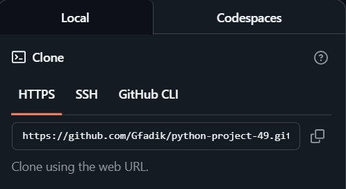

### Hexlet tests and linter status:

Badges: 

### Project Description
This is Hexlet's first python project. It includes several math games.:
1. "Parity check" (brain-even)
2. "Calculator" (brain-calc)
3. "NODE" (brain-gcd)
4. "Arithmetic progression" (brain-progression) 
5. "Is a prime number?" (brain-prime)

### Minimum requirements
1. python3
2. Internet connection

### Installation
1. Follow the link on GitHub
https://github.com/Gfadik/python-project-49#
2. Click on the green "<> Code" button

3. In the window that opens, go to the "HTTPS" tab and copy the link.

4. Open a terminal, navigate to a directory that is convenient for you, and write the command
-git clone <copied link>
5. The project is installed.cTo start the game, enter one of the following commands:
1.brain-games
2.brain-even
3.brain-calc
4.brain-progression
5.brain-prime
### Gameplay

Brain-even: 

Brain-calc: 

Brain-gcd:  

Brain-progression:  

Brain-prime:  